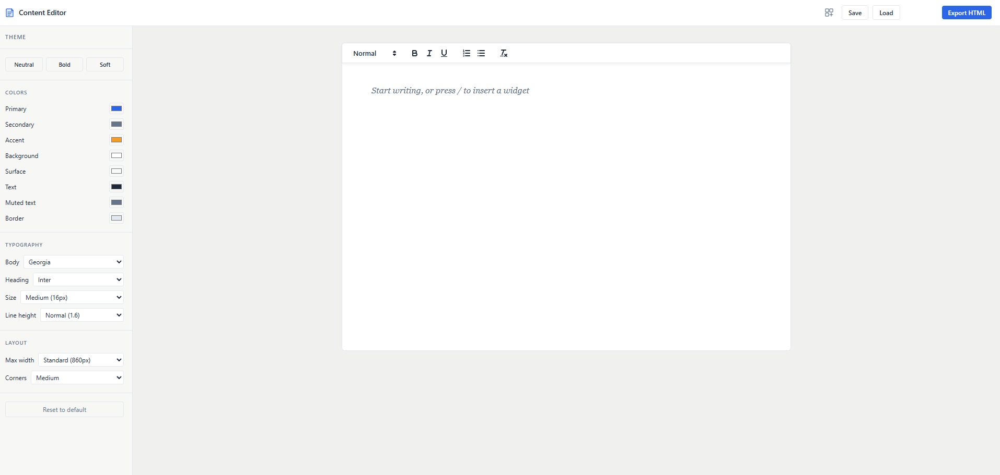
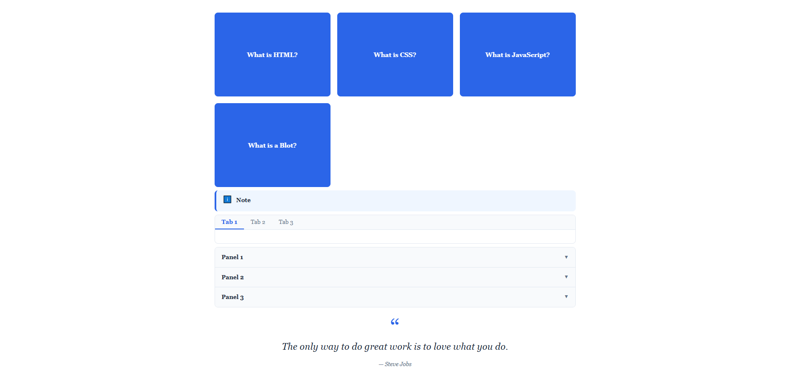

# HTML Content Editor

[](LICENSE)

A free, self-hosted WYSIWYG authoring tool for instructional designers. Build rich interactive eLearning content in the browser, then export a single fully self-contained HTML file that deploys anywhere — no subscription, no backend, no lock-in.

**[Live demo →](https://frankyface.github.io/HTML-Content-Editor/)**

---

## Screenshots





---

## Why

Tools like Articulate Rise and BrightSpace cost $1,000+/year per seat and constrain what you can produce. HTML Content Editor is free, open-source, and outputs raw HTML — the most portable format on the web. If you can open a browser, you can author and publish.

---

## Features

**Editor**
- Quill 2.0 writing surface — text, headings, lists, bold/italic
- Slash command (`/`) to insert any widget by name with fuzzy search
- Toolbar dropdown as a secondary widget insertion point
- Live theme panel — set colors, fonts, and spacing via CSS custom properties

**Save & Export**
- Save your project as a portable JSON file — download and reload any time, no account required
- Export as a single `.html` file — all CSS, JS, and images base64-inlined, zero external dependencies
- Works in air-gapped environments, SharePoint, Confluence, course portals, and email attachments

**10 Interactive Widgets**

| Widget | Description |
|--------|-------------|
| Callout / Alert | Info, warning, success, and danger notice boxes with ARIA roles |
| Tabs | Tabbed content panels — keyboard navigable |
| Accordion | Expandable / collapsible sections with CSS grid animation |
| Stylized Quote | Pull quote, sidebar quote, or highlighted quotation |
| Timeline | Linear sequence of steps or events |
| Flip Cards | Cards that reveal a back face on click; 2/3/4-column grid |
| Click & Reveal | Content hidden behind a click trigger; 3 trigger styles |
| Carousel | Image/content slider with prev/next, dots, and autoplay |
| Hotspot | Image with clickable pin markers and tooltips |
| Knowledge Check | Multiple-choice self-assessment with per-option feedback, hints, and retry |

---

## Getting Started

No build step. No install. No account.

```bash
git clone https://github.com/Frankyface/HTML-Content-Editor.git
cd HTML-Content-Editor
```

Serve over localhost (required — Chrome blocks certain Quill internals on `file://`):

```bash
# Python 3
python -m http.server 8080

# Node (no install needed)
npx serve .
```

Open `http://localhost:8080` in Chrome, Firefox, or Edge.

1. Write your content — headings, paragraphs, lists
2. Press `/` to insert a widget, or use the toolbar dropdown
3. Adjust colors and fonts in the left theme panel
4. Click **Save** to download your project as JSON
5. Click **Export HTML** to download the finished, self-contained page

---

## Deploy Anywhere

The exported file works:
- Hosted on any static web server or CDN
- Uploaded to SharePoint or Confluence (iframe embed)
- Sent as an email attachment
- Dropped into any course portal that accepts raw HTML
- Opened locally — no server needed for the exported page

---

## Project Structure

```
├── index.html              — editor shell (no build step)
├── src/
│   ├── editor.js           — Quill init and tab title management
│   ├── registry.js         — central widget registry
│   ├── slash-command.js    — '/' keypress handler with fuzzy search
│   ├── toolbar.js          — toolbar widget dropdown
│   ├── save-load.js        — JSON project save / load
│   ├── export.js           — single self-contained HTML export
│   └── blots/
│       ├── base.js         — BaseWidgetBlot all widgets extend
│       ├── callout.js
│       ├── tabs.js
│       ├── accordion.js
│       ├── quote.js
│       ├── timeline.js
│       ├── flip-cards.js
│       ├── click-reveal.js
│       ├── carousel.js
│       ├── hotspot.js
│       └── knowledge-check.js
└── src/styles/             — editor and widget CSS
```

---

## Tech Stack

| Concern | Choice | Why |
|---------|--------|-----|
| Editor | Quill 2.0 | Clean Blot system for custom embeds |
| Language | Vanilla JS | No framework overhead; works without a build step |
| Widgets | Custom Quill Blots | Self-contained nodes owning their HTML/CSS/JS |
| Theming | CSS custom properties | Injected into export `<style>` block at export time |
| Save format | JSON download / upload | Portable, versioned, no backend required |
| Export | Inline everything | Zero runtime dependencies — works offline |
| Hosting | GitHub Pages + local file | Free, no infrastructure |
| Backend | None | Deliberately excluded |

---

## Contributing

See [CONTRIBUTING.md](CONTRIBUTING.md) for a step-by-step guide to adding a new widget.

Bug reports and feature requests: [open an issue](https://github.com/Frankyface/HTML-Content-Editor/issues).

---

## Roadmap

| Stage | Goal | Status |
|-------|------|--------|
| 1 — Foundation | Quill shell + live theme panel | ✅ Done |
| 2 — Widget System | Blot base class + slash command | ✅ Done |
| 3 — Tier 1 Widgets | Callout, Tabs, Accordion, Quote, Timeline | ✅ Done |
| 4 — Export Engine | Single self-contained HTML, zero deps | ✅ Done |
| 5 — Tier 2 Widgets | Flip Cards, Carousel, Hotspot, Knowledge Check | ✅ Done |
| 6 — Polish + Release | Public v1, GitHub Pages live | ✅ Done |

**Post-v1 widget candidates:** scenario/branching, image comparison (before/after slider), video embed, labeled diagram, expandable table, progress checklist, animated stat counter, audio player with transcript toggle.

---

## License

MIT — see [LICENSE](LICENSE).
